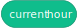
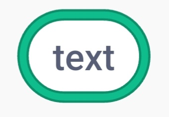
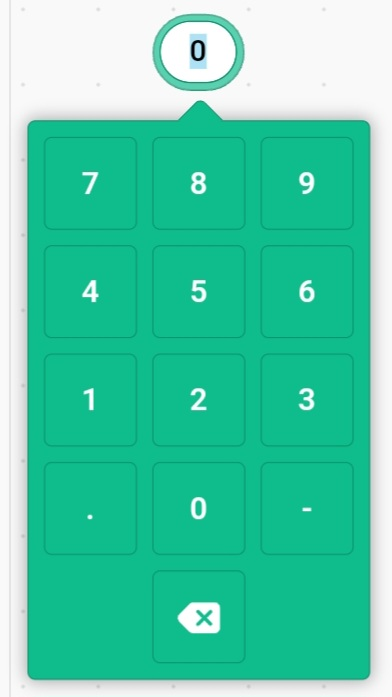
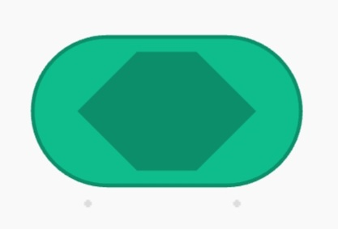
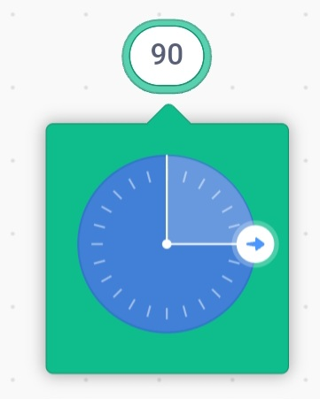
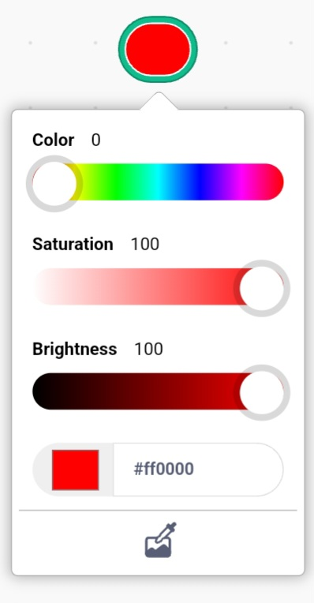
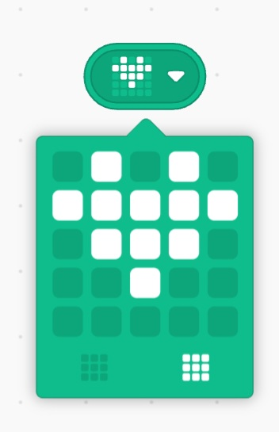
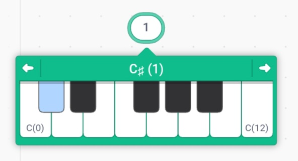
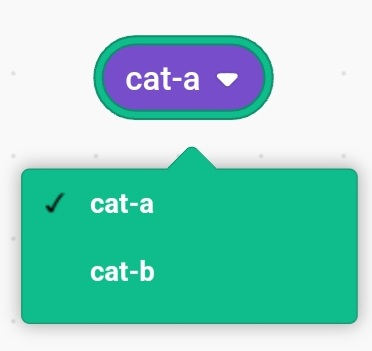
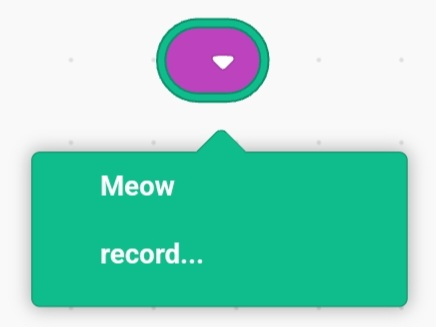

Type each block on a seperate line.

## Syntax
### Blocks:
```
text|opcode|type
```

*:information_source: For labels you can leave the opcode section blank, but you **MUST** still include it*

***Example:***
```
current hour|hourNow|r
```

***Makes:***
 with the opcode `hourNow`

*:information_source: The block's text can also include pipes (`|`)*

### Inputs:
```
[defaultValue|argName|type]
```
To add an argument to a block, just add the above in the block text.

*:information_source: For boolean, costume, and sound inputs you can leave the defaultValue section blank, but you **MUST** still include it*

*:information_source: The input's deafultValue can also include pipes (`|`), but it **CANNOT** contain `[` or `]`*

*:information_source: Buttons and labels cannot have inputs*

***Example:***
```
alert [hello|text|s]|alert|c
```
***Makes:***
![scratchblocks rendered version of `alert [hello]`](./images/exampleinputblock.svg) with the opcode `alert`


## Types
Specifies the type of block/input. These values are **NOT** case sensitive.
### Block types:
 - `r` or `reporter` 
 - `b`, `bool` or `boolean` 
 - `c` or `command` 
 - `lb`, `lbl` or `label` 
 - `bt`, `btn` or `button`
### :warning: Special/Complicated blocks :warning:
These blocks will most likely require you to edit the generated extension for them to work properly
 - `h` or `hat` 
 - `e` or `event` 
 - `l` or `loop` 
 - `cl` or `conditional` 
### Input types
 - `s`, `str`, `t`, `txt`, `text` or `string` 
 - `no`, `num`, `#` or `number` 
 - `b`, `bool` or `boolean` 
 - `a`, `d`, `dir`, `direction` or `angle` 
 - `c` or `color` (or `colour` if you wish) 
 - `m` or `martrix` 
 - `n` or `note` 
 - `cm` or `costume` 
 - `sd` or `sound` 
 - `i`, `img` or `image`